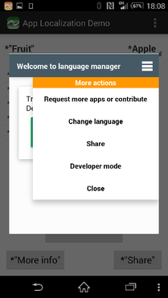

Android Dynamic Resource Management: Nativer SDK
================================================

Nativer SDK adds dynamic resource management to any Android app, so language resources can be downloaded on a live app:
- Localization process can be decoupled from the app build cycle
- Translation work can be executed on-screen in-app having immediate feedback
- Management console added to provide control on user, machine and pro generated resource creation, distribution and usage. 

Nativer SDK integration in 15 minutes
--------------------------------------------------
No source code change needed in your app, only few configuration files have to be modified to integrate and utilize the SDK.

For Android Studio an integration plugin released to automate the process: [Android Studio plugin](https://github.com/Transround/NativerSDK/tree/master/tools/nativer-admin-plugin-android-studio/README.md).
The plugin will guide you through the integration and will carry out the necessary configuration file changes for your app. It also guide you through the testing of the integration and the setup of the resource management consol backend. 

For Eclipse IDE we provide a step-by-step integration instructions: 
[Integration under Eclipse](https://github.com/Transround/NativerSDK/wiki/How-to-integrate-Nativer-SDK).

For reference of the complete integration, testing and configuration process please visit the [Nativer Developer Console] (http://developer.nativer.com/).

Testing the integration
-----------------------
Generate a new APK and load it on your phone.

After you start your app - Nativer SDK automatically launching the language manager popup screen. From the top right corner menu choose the developer mode.

Each translatable resource is marked with a star at the beginning of the resource string. Shake your phone to switch between the original and the test versions. If the translation scope is ok then your app is ready for On-device resource localization. 

Configuring the backend
------------------------

Before publishing your app you can configure how language resources are generated and used, and how to set up integrated analytics to get insights the language impact of user behaviour.

For Setting languages pls. go to [Developer console - Language setting ](http://nativer01.nativer.com/prod/admin/index.php?route=localisation/language_setup)  using your registration account.

For Setting Analytics pls. go to [Developer console - Analytics setting ](http://nativer01.nativer.com/prod/admin/index.php?route=catalog/tracking) using your registration account.
Sample Multilanguage Android app project
----------------------------------------
You can check how easy to build in the SDK and try the it's main features using our sample [App Localization project] (https://github.com/Transround/NativerSDK/tree/master/nativer-sdk-sample).

Glossary
--------

*Host Application*: Is the original Application of a developer. The App Localization Demo (https://github.com/Transround/NativerSDK/tree/master/nativer-sdk-sample) is an example of a host application. By adding the Nativer SDK to it, becomes NLE (Nativer Localization Enabled) Application.

*NLE Application*: Stands for Nativer Localization Enabled Application. This is an original Application of a developer, in which the Nativer SDK has been embedded.

*Nativer SDK*: A set of functions and libraries, which enable the host Application to become easily translatable in the Nativer Ecosystem.

*Nativer Application*: This is Transround&rsquo;s own application, called Nativer, which implements majority of the functionality of the Nativer Ecosystem, like requesting localizations, downloading ready localizations, translate, proof reading, support, etc.
