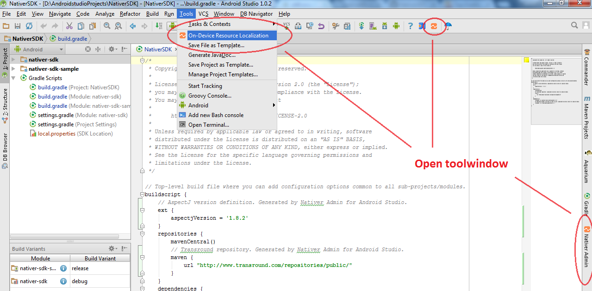
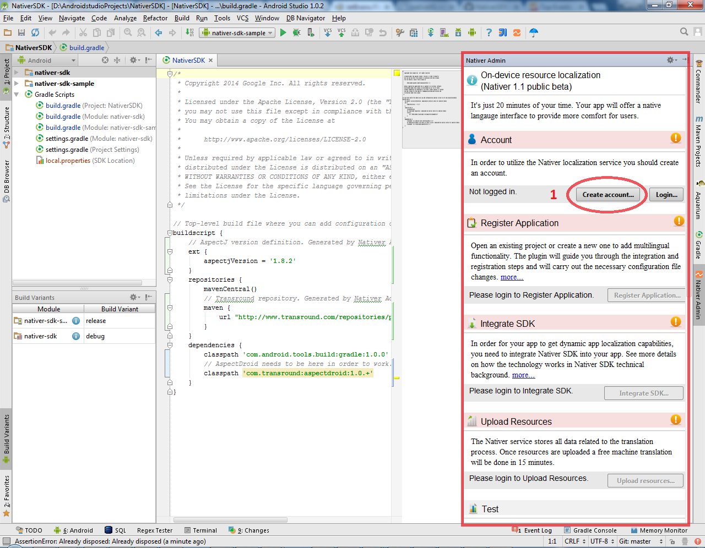
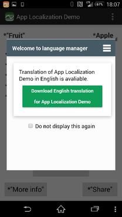

Enabling your users to use their languages within your app: It’s less than 20 minutes of your time to let users learn and practice languages while translating and using your app.
Android on-device resource localization
=======================================

Adds dynamic string resource management features enabling:

* in-context community translation,
* on-the-fly localized string resource download,
* gesture driven language change by shaking the phone

Supports 70+ languages including Chinese, Right-to-left languages

Instructions
------------

**Important note**: in case you are using Android Studio version 1.1.x and run into error "Error:No such property: bootClasspath for class: com.android.build.gradle.AppPlugin" when building your project then please follow this workaround until we fix the issue.

Please modify the gradle version from 1.1.0 to 1.0.0 in your project's build.gradle file.

The build.gradle should contain the following section

```groovy
    ...
    dependencies {
        classpath 'com.android.tools.build:gradle:1.1.0'
    ...
```

that should be changed as follows

```groovy
    ...
    dependencies {
        classpath 'com.android.tools.build:gradle:1.0.0'
    ...
```

This modification should solve the above compilation error.
-

In Android Studio choose File -> Settings -> Plugins -> Browse repositories -> Android On-Device Resource Localization. 
Then install selected plugin.


After restart Android Studio from Tools menu select “On-device resource localization”.



At the first use you need to register yourself and your app to the localization 
backend service - 90 days trial - no commitment from your side.



Then register your app (step 2), integrate SDK (step 3) and upload translatable resources of your app (step 4).


After successful registration and resource upload - the backend service generates 70+ language resource files for your app. 

Testing: Generate a new APK and load it on your phone.
After you start your app - language manager screen appears: choose developer mode from the menu.




Then in your app all your translatable resources will have a star added to the beginning of the resource string. 
Shake your phone to switch between the original and the test versions. 

Your app is ready for On-device resource localization.
Download the translator app [Nativer from GooglePlay](https://play.google.com/store/apps/details?id=com.transround.nativer&referrer=utm_source%3Dgithub%26utm_medium%3Dreferral%26utm_campaign%3Don-device-leiras) to see the translation experience. 


